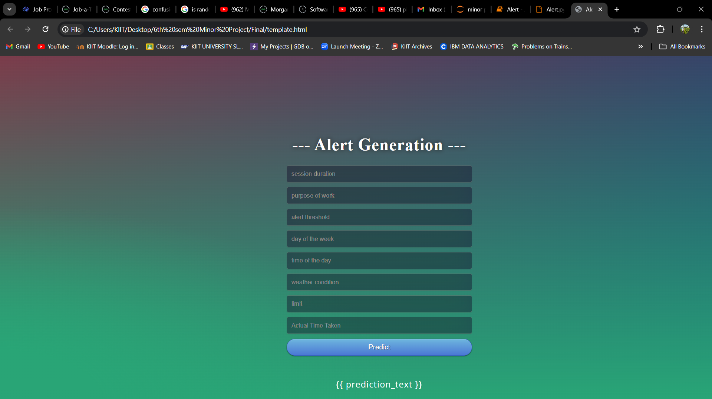
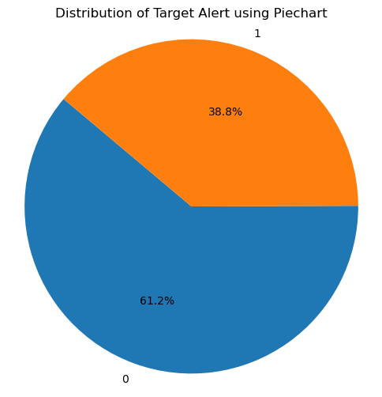

                                                                  REAL TIME SESSION MONITORING SYSTEM 

This is the repository for the Minor Project that I undertook in the 6th Semester of my college .
The Project's foundation is built on concepts involving Machine Learning Algorithms and Real Time Session monitoring
based on manually curated dataset by taking into consideration ceratin viable parameters and target variable that would initially help in 
raising an alert and sending to the emergency contacts of the user. This is basically a research and development project that I worked upon 
along with my team. The machine Learning Algorithm that we used was Random Forest Classifier . We generalized the code using Python and its useful libraries 
which in turn helped significantly in proceeding with the project.
  
  
  
  

 <figure>
  <t><figcaption>User Interface</figcaption></t>
    
  <t></t>  
</figure>

  
  
  
 
<figure>
  <figcaption>Piechart Distribution</figcaption>
    
</figure>

 
 
 
 
The idea behind the project was to create an application system that would be tracking the real time data for an user who belongs to the Divyang community. 
The plan was to build up a dataset based on real time situations that might occur in our everyday life and then considering the best among those parameters.
We decide many such works were to be mentioned in the workspace according to various needs for a common individual and we decided to set a particular time threshold 
for each such acitvity . An active session duration calculator would calculate the real time required for an acitivity, which will be matched with the threshold set previously
for each such activity, if the time tracked will be equal or approximately around a limit for  a particular threshold then the alert won't be generated but if that is exceeded
then the alert is going to be generated.
 
 
<figure>
  <figcaption>Tree Plot</figcaption>
    
</figure>
 
 
Among these various models, the accuracy was the most for the Random Forest Classifier model which was equal to : Accuracy: 97.368   : 

Isolation Forest: Final Accuracy : 23.684

Efficient for detecting anomalies or outliers in data.
Well-suited for situations where the majority of the data is normal, and anomalies are rare.

Random Forest:  Accuracy: 97.368

Versatile for both classification and regression tasks.
Can handle a mix of numerical and categorical features.
Robust and less prone to overfitting.

So, accordingly we chose this model and proceeded forward in working with these model for our project.

Author - Soumik Ghosh.

